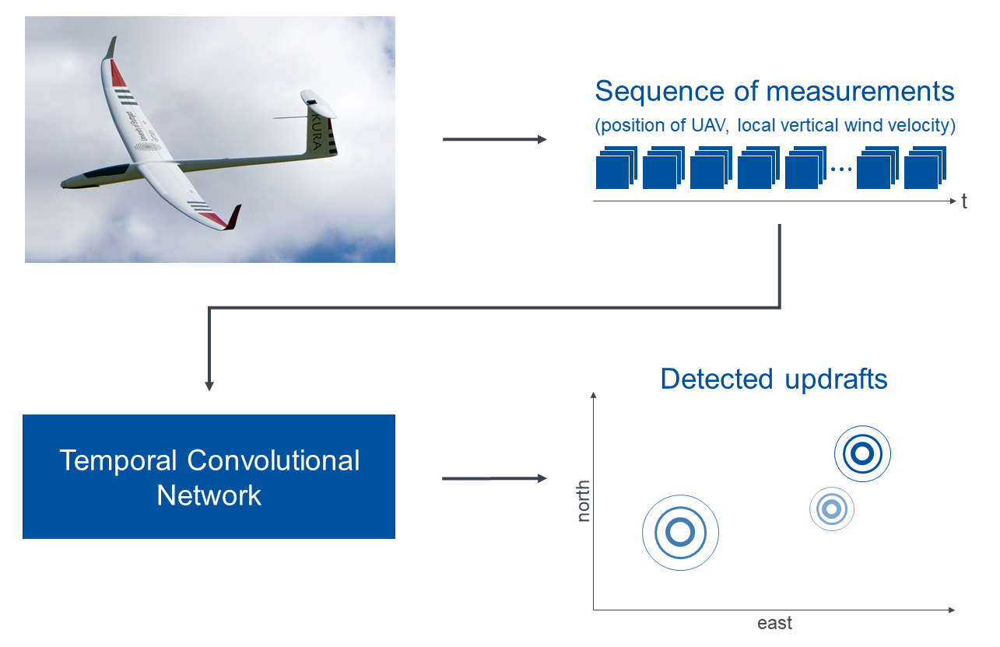

# End-to-End Thermal Updraft Detection and Estimation for Autonomous Soaring Using Temporal Convolutional Networks
<p align="center">
	Christian Gall, Walter Fichter, and Aamir Ahmad <br>
	University of Stuttgart, 70569 Stuttgart, Germany <br>
</p>



Exploiting thermal updrafts to gain altitude can significantly extend the endurance of fixed-wing aircraft, as has been demonstrated by human glider pilots for decades. In this repository, we present the code of a novel end-to-end deep learning approach for the simultaneous detection of multiple thermal updrafts and the estimation of their properties - a key capability to let autonomous unmanned aerial vehicles soar as well. In contrast to previous works, our approach does not require separate algorithms for the detection of individual updrafts. Instead, a sequence of sensor measurements from a time window of interest can be directly fed into our temporal convolutional network (TCN), which estimates the position, strength, and spread of the encountered updrafts. Our approach can reliably detect updrafts solely based on measurements of the aircraft's position and the local vertical wind velocity. Nevertheless, our method can additionally make use of measurements of the roll moment induced by updrafts, which improves the precision further.

The corresponding paper *End-to-End Thermal Updraft Detection and Estimation for Autonomous Soaring Using Temporal Convolutional Networks* has been accepted for presentation at the *2024 IEEE International Conference on Robotics and Automation (ICRA)*. The citation information will be added once the paper has been published.

## Getting Started
Please execute these commands in a terminal to download the code, create a virtual environment using [conda](https://docs.anaconda.com/free/miniconda/index.html), and install the required packages:

```bash
git clone https://github.com/robot-perception-group/tcn-updrafts-estimator.git
cd tcn-updrafts-estimator
conda env create -f environment.yml
conda activate tcn-updrafts-estimator
```

In the folder `config`, we provide two annotated example config files. Please feel free to modify them and create your own config files. 

In the folder `dataset_generation`, we further provide the waypoint file `waypoints.json` containing an example flight path that the glider can track in the simulation. Alternatively, you can build upon the class `PathGenerator` in `path_generator.py` to create your own flight paths.

## Dataset Generation
The script `generate_dataset.py` can be used to run simulations to generate a dataset for training and testing the TCN. 

#### Example using the provided config and flight path:

```bash
python generate_dataset.py config/config_with_roll_moment_data.yaml dataset_generation/waypoints.json --index_start 0 --index_end 39999 --output_dir datasets --dataset_name v1 --sub_folder train --transform_path  # Generates a training set
python generate_dataset.py config/config_with_roll_moment_data.yaml dataset_generation/waypoints.json --index_start 0 --index_end 9999 --output_dir datasets --dataset_name v1 --sub_folder val --transform_path  # Generates a validation set
```

For further instructions, run `python generate_dataset.py --help`.


## Training and Validation
The script `train.py` can be used to train and validate the TCN using the generated dataset.

#### Example using the provided config:

```bash
python train.py config/config_with_roll_moment_data.yaml --dataset_dir datasets/v1 --checkpoints_folder checkpoints --models_folder models
```

For further instructions, run `python train.py --help`.

#### TensorBoard support:

The script supports *TensorBoard*. To inspect the training and validation progress, run the following commands in a separate terminal window, and open http://localhost:6006/ in your web browser:

```bash
conda activate tcn-updrafts-estimator
tensorboard --logdir=runs  # Assuming that you execute this command in the code directory
``` 
Once you can see *TensorBoard* in your web browser, click on the tab *TEXT* to compare the TCN's estimates with the true updraft properties from the dataset. 

#### Format of the output estimates:

The TCN outputs the estimates, which are normalized as specified in the config file, in the following order:

`[north pos. updraft #1, east pos. updraft #1, strength updraft #1, spread updraft #1, north pos. updraft #2, east pos. updraft #2, strength updraft #2, spread updraft #2, ...]`

Output values of -1 indicate that no more updrafts were detected. For example, if only one updraft was encountered, the values of `north pos. updraft #2, east pos. updraft #2, strength updraft #2, spread updraft #2, ...` will be approximately -1.
